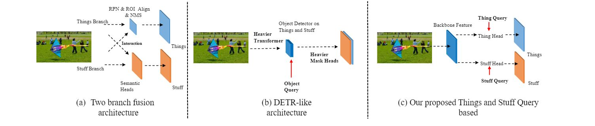

# QueryPanSeg-ICIP-2022.

Query Learning of Both Thing and Stuff for Panoptic Segmentation

Our method with ResNet-50 as backbone achieves 45.1 PQ on COCO test-dev and outperforms all previous work using the same backbone but with a much simpler pipeline. Our methods achieves 47.6 PQ when using ResNet-101 as backbone on COCO test-dev which supress many previous state-of-the-art method using complex pipeline.

 

